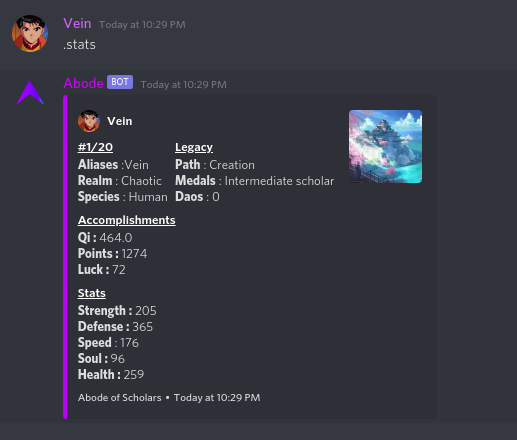
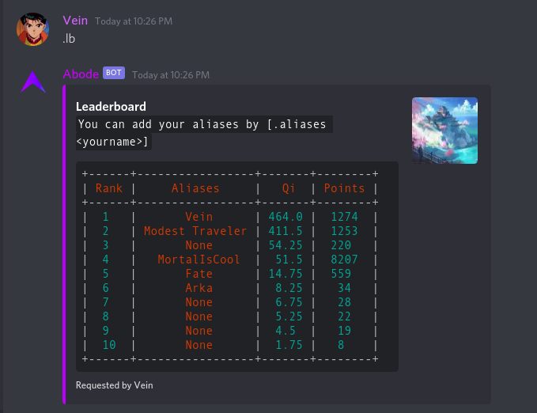
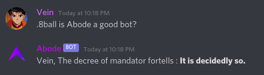
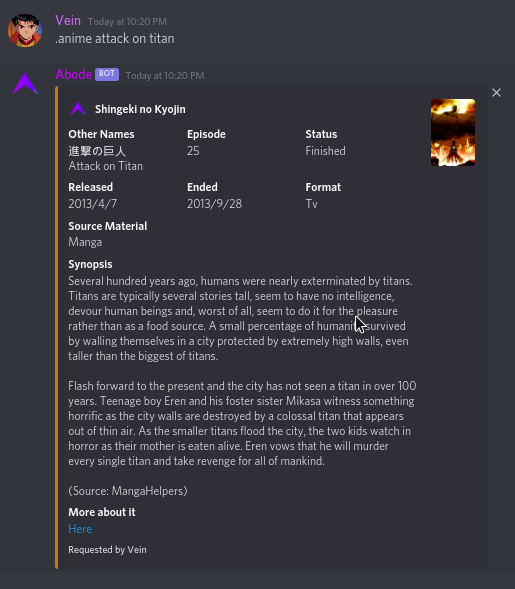
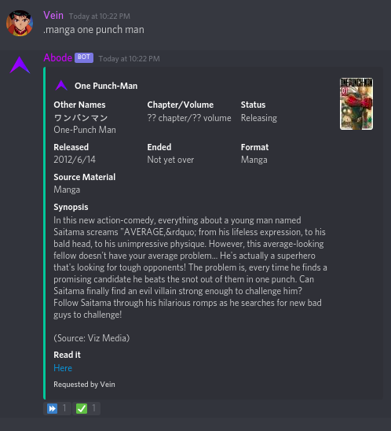
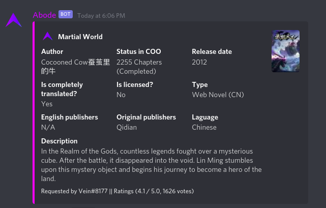
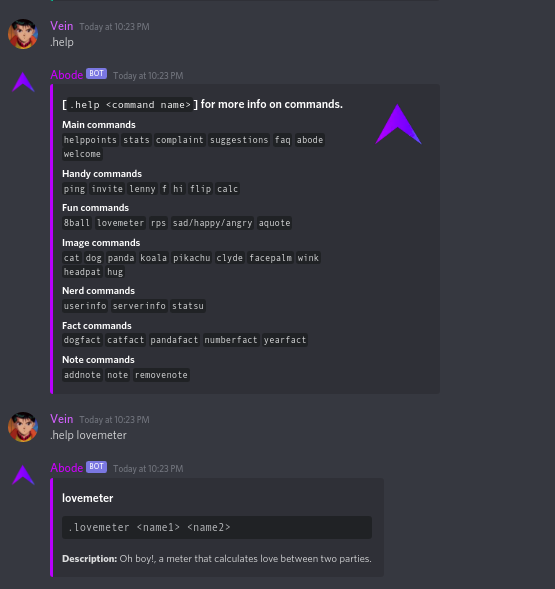

# 🤖 The Abode Mandator (Discord Bot)
>The Abode Mandator as Abode is a multipurpose bot specially made for my personal discord server.

## 🛠️ Abode's features
- ⬆️ Leveling
- 🔨Moderation 
- 🔨Admin commands
- 🔨Owner commands
- 🔥Beautiful help command 
- 🏀 Fun 
- 🌆Images 
- 💪Database commands
- ❤️Anime and manga commands.
- ❤️❤️An wuxia themed environment(working on it)
- 🛒Shop,economy commands(working on it)

## Note 
>This bot is configured for my server, if you would like to clone it you would need to put some efforts youself :)

## Why is a bot for a private server open source?🤨
>Well, I like opensource things, and this repo is not for you to just git-clone it and hope it would work.I'm too lazy to do stuffs like that.Just browse through the code and if you find the code helpful star the repo if not I'm sorry. 

## Leveling

## Leaderboard

## Fun 

##Anime

## Manga

## Wuxia

## Help

